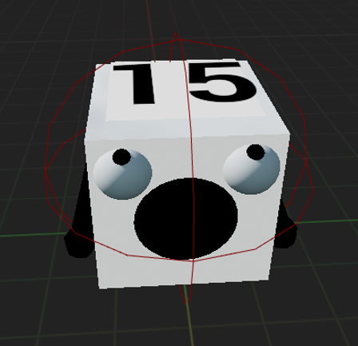
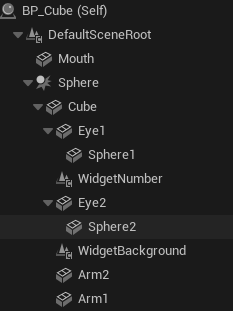
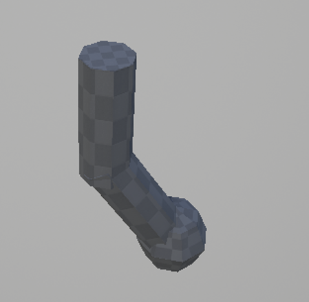
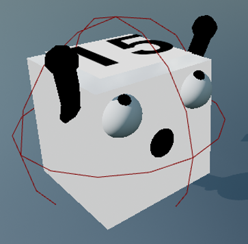
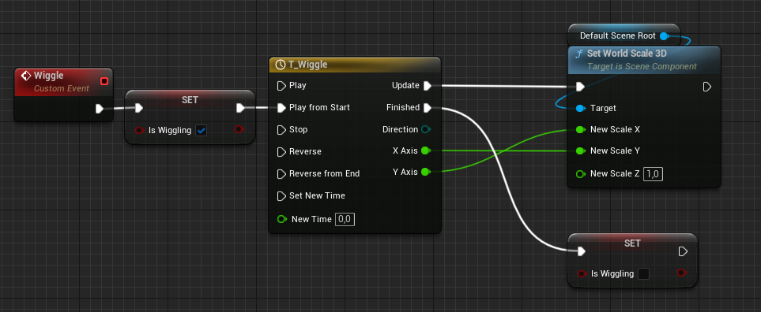
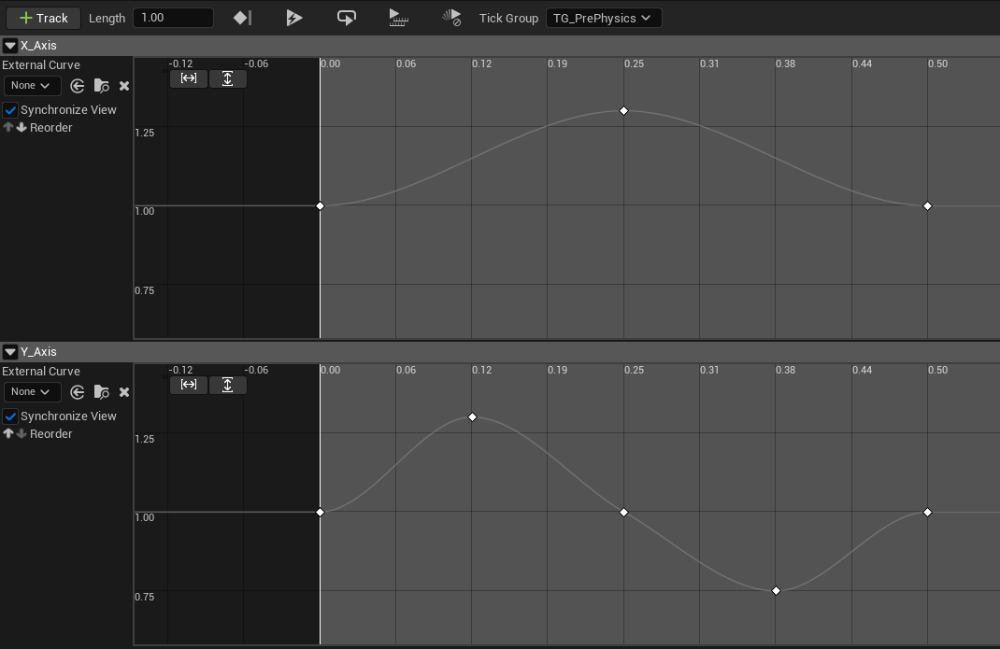
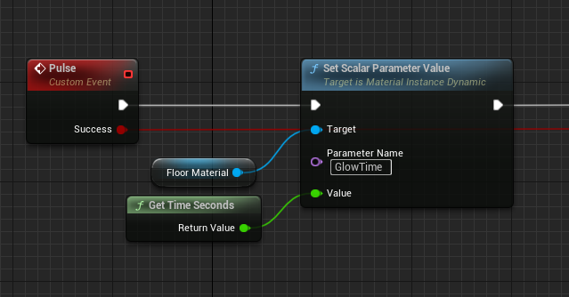
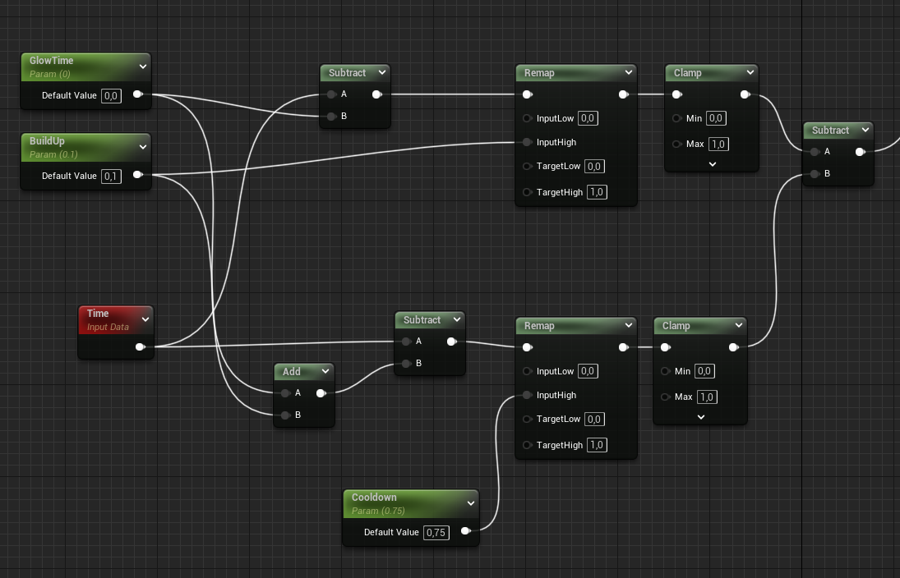

+++
title = "GAME JUICE PART 1"
description = "How to make your games more appealing"
date = "2023-03-15"
author = "Jannis Wolf"
+++

# Let's build a game!

So I had this idea of a game, where the player needs to do mental arithmetic. 

I sat down and coded something up in Unreal. Overall maybe a day or two later, I had this



The idea is that you need to add numbers until you reach the target in the bottom corner. 

Now, I can't blame anyone if they just scroll past if they saw this. It's bland, there is no sense of victory when you succeed, 
there is no life. And it took me quite a while to understand that these things **are important**. Once you see past
the silly-nilly thinking of it being just aesthetics, you will see that even a hardcore-gamer-brain like ours is
just as susceptible to these little bite-sized brain cookies. 

So while our initial goal, building a game possibly for little kids to teach them some math
is done here, we need to make sure that we can keep their attention while they play. 
In the end, if your audience is captivated for longer, you get more chances to tell your story,
to get your deep game-meaning to them. 

# Step 1 - Bring Your Objects To Life

Think about what you can do to breathe some life into your objects. It can be subtle things. 
I decided to turn them into tiny cubes with arms and a mouth, and give them some small amount 
of idle movement. 



I also made sure that they follow the movement of the player. I could have maybe given them a little bit slower rotation
speed, as that will highlight their autonomy. Never underestimate eyes, this one is such a simple setup, it's literally just 
a white sphere with a smaller black sphere. 

I quickly made the arms in Blender by throwing together two cylinders and a sphere and gave everything the default black unlit
material. The arms also serve another purpose. When you pick a cube up, you can now make them _grab_ the cube in front, making 
it look like they are all having fun in a polonaise. Furthermore, when a player succeeded in picking up all necessary numbers, 
we can do a simple timeline to swing the arms up, having the little cubes cheer our player.

I also added a very simple timeline effect when a player picks a cube up, as well as when they spawn. Basically you just want
to scale the object a little bit randomly. The exact amounts don't matter at all, just throw some animation in there. 
Really I mean it, **DO ANYTHING**, just don't let your static meshes sit there doing nothing. There's a reason
like any sprite, any character, comes with an idle animation. 



Note that the above implementation is not perfect. I had to add a _guard_ with the `isWiggling` boolean, as there
are multiple timelines _competing_ around animating the scale. The best way to solve this is to have them all run
side-by-side, and instead of updating the scale directly, multiply each into a variable that is reset to `1.0` each tick.
Then one central function can take that variable and use it to actually update the scale last. That way you can 
blend multiple animations on top of each other. 

Without this boolean, there would be a sudden jump in the scale, which could break the immersion of the player quite quickly. 

# Step 2 - Player Feedback

Another incredibly important part is giving feedback to the player, both positive and negative. 
In this example, we will add a background material to add to the immersive feeling of playing in an arena.
My reference to this was a TV studio, in which the whole floor can be a gigantic TV screen. But you can
come up with your own design based on your game. 

Material based effects are often intimidating for beginners. The important thing to keep in mind when
it comes to shaders that you don't turn them _on_ or _off_ like you would do with an animation. The shader
runs **every** frame, for **every pixel**. So you need to come up with another way to signal `start` as well
as `location`. I will use the term `shader` and `Material` somewhat interchangeably here. I think it's
important to keep in mind that it is fundamentally a shader, even though Unreal Engine has built this 
amazing abstraction around it.

Luckily we *do* have a way to pass information into the shader, namely _Material Parameters_. Using the `Time` 
input node in the shader, we can effectively build ourselves a simple time-based if/else. 

Pass in the current time through Blueprint like this

and then in the Material you **substract** the current time from `GlowTime`. The result is that you get
an output that represents _how long since the animation was triggered_. If you feed this output into a 
`Remap` node, you can ramp up the effect, and with another `Remap` node substracted you can fade out the effect again. 

It can be a little bit irritating to work with Materials like this initially. I highly urge anyone reading this
to build such a system from scratch, as it will really elevate your skill level. Shaders are incredibly powerful
and at the same time are very cheap. 

I added another parameter to denote the color, and now, whenever the player succeeds or fails to reach the target,
we can present him with a nice animation. On it's own it can be a little bit jarring, but it blends nicely together
with the other effects to create this full endorphine-releasing effect of success. This is the final result 
for the arena effect. 



We will also include a simple but effective Niagara Effect. This one actually is almost a stock effect, I just
changed the material to `Gold` and scaled it to the size of the arena, made the snippets a bit bigger, just some
random modifications that felt good at the time. Again, I'm going for this effect like you're in some game show
and they just released the glitter!



After playing this for a little bit, I decided to also clear the entire board after completing a level. It gets
quite tricky after some time, and it was a little bit of sensory overload to join into a level with the board fully 
populated. In addition, this actually adds to the excitement, as each cube explodes with it's own animation!

# Step 3 - UI

Alright, time for some UI, everyones favorite topic. Here's a quick tip - **animate everything**. Like above, you
never want a lifeless number just changing from 5 to 4. If a number changes, make it stand out by giving it a little
bit of juice. Just the tiniest amount of scaling will do so much work. You will do the player a great favor by
letting him know that, _Hey, this number over here changed!_. Just don't add any of these crazy rotations and 
translations unless you are certain that this is what is necessary. Most of the time, a simple `1.2` scale animation
over a second will do wonders. 

For single player games, another really cool trick you can do is play with `Global Time Dilation`. If you set it to a low
value for just a few frames, it will really add weight to your players actions. This is quite commonly done in fighting games,
when that important punch connects, it gives this short stuttering effect, and it feels like for this blink of an eye
the whole world stands still. Just make sure you do it in an actual moment of short _bliss_. You don't want to interrupt
your player with it. So in our case, we don't want to add it when collecting a cube, as the player is likely counting
in his head and planning his moves, and it would interrupt him. However, once he has cleared the level, now is a good moment
to give him a short breathing pause. 

I added a few more effects here and there, and in the end this is what we got. I still need to work on the UI.
If this were a real game you can't really go with the stock text nodes, as they are just too much of a contrast 
to the remaining game. Instead you want to create the widgets through another tool, maybe that's a topic for another post. 



